<!-- version -->
<div align=right>
<font style="color:#26a169; font-size:80%">Processed: 2024.08.30 13:42</font>
</div>

```{r setup, include=FALSE}
knitr::opts_chunk$set(echo = TRUE, 
fig.width=7, fig.height=6,
fig.align = "center",
comment = NA)
```

```{css, echo=FALSE}
.bgobs {
  background-color: #f5e9ab;
 }
.bgcodigo {
  background-color: #94a6aa;
 }
.bgsaida {
  background-color: #ecf7db;
 }
```


\clearpage
# Descriptive statistics

<pre>

  ----------
  - raw data
  ----------
     RF_mBT_1   RF_mBT_2   RF_mBT_3   RF_mBT_4   RF_mBT_5   RF_VSN_1   RF_VSN_2   RF_VSN_3   RF_VSN_4   RF_VSN_5
 1        0.9        0.8        0.8        0.8        0.8        0.9        0.8        0.9        0.9        0.8
 2        0.6        0.6        0.5        0.5        0.4        0.7        0.8        0.8        0.7        0.6
 3        0.8        0.8        0.8        0.8        0.8        0.7        0.6        0.6        0.6        0.6
 4        0.8        0.8        0.8        0.8        0.8        0.8        0.8        0.8        0.8        0.7
 5        0.9        0.9        0.9        0.8        0.9        0.9        0.7        0.7        0.8        0.8
 6        0.9        0.9        0.9        0.9        0.9        0.7        0.6        0.6        0.7        0.7
 7        0.8        0.7        0.8        0.7        0.8        0.9        0.9        0.9        0.9        1.0
 8        0.8        0.7        0.7        0.6        0.7        0.7        0.6        0.6        0.6        0.6
 9        0.7        0.8        0.7        0.7        0.8        0.8        0.7        0.7        0.7        0.6
10        0.7        0.7        0.7        0.7        0.7        0.5        0.5        0.6        0.6        0.6
11        0.7        0.7        0.7        0.7        0.7        0.9        0.9        0.9        0.9        0.8
12        0.8        0.8        0.8        0.8        0.7        0.6        0.7        0.7        0.7        0.7
13        0.9        0.9        0.9        0.8        0.9        0.5        0.6        0.7        0.6        0.6
14        0.9        0.9        0.9        0.8        0.9        0.8        0.9        0.9        0.9        0.9
15        0.7        0.8        0.7        0.7        0.7        0.7        0.7        0.7        0.8        0.8
16        0.8        0.9        0.9        0.8        0.8        0.8        0.8        0.9        0.8        0.8

   ---------
   - summary
   ---------
              RF_mBT_1       RF_mBT_2       RF_mBT_3       RF_mBT_4       RF_mBT_5       RF_VSN_1       RF_VSN_2       RF_VSN_3       RF_VSN_4       RF_VSN_5
   Min.     Min.0.6071     Min.0.5714     Min.0.5357     Min.0.5357     Min.0.4464     Min.0.5200     Min.0.5200     Min.0.5800     Min.0.5636     Min.0.5600
1st Qu.   1stQu.0.7391   1stQu.0.7290   1stQu.0.7202   1stQu.0.7314   1stQu.0.7202   1stQu.0.6636   1stQu.0.6247   1stQu.0.6438   1stQu.0.6585   1stQu.0.6409
 Median   Median0.7940   Median0.7831   Median0.7898   Median0.7639   Median0.7857   Median0.7355   Median0.7201   Median0.7294   Median0.7434   Median0.7033
3rd Qu.   3rdQu.0.8654   3rdQu.0.8552   3rdQu.0.8613   3rdQu.0.8408   3rdQu.0.8432   3rdQu.0.8443   3rdQu.0.8493   3rdQu.0.8736   3rdQu.0.8496   3rdQu.0.8329
   Max.     Max.0.9455     Max.0.9000     Max.0.8909     Max.0.9091     Max.0.9400     Max.0.9492     Max.0.8814     Max.0.9492     Max.0.8983     Max.0.9661
   Mean     Mean0.7998     Mean0.7825     Mean0.7791     Mean0.7648     Mean0.7715     Mean0.7390     Mean0.7281     Mean0.7554     Mean0.7447     Mean0.7267
   s.d.             NA          0.117          0.131          0.089          0.118          0.101          0.091          0.127          0.102          0.135
      n             16             16             16             16             16             16             16             16             16             16
     NA              0              0              0              0              0              0              0              0              0              0

  ---------------------
  - data under analysis
  ---------------------
     RFMBT   RFVSN
 1     0.8     0.9
 2     0.5     0.7
 3     0.8     0.6
 4     0.8     0.8
 5     0.9     0.8
 6     0.9     0.7
 7     0.8     0.9
 8     0.7     0.6
 9     0.8     0.7
10     0.7     0.6
11     0.7     0.9
12     0.8     0.7
13     0.9     0.6
14     0.9     0.9
15     0.7     0.7
16     0.8     0.8

   ---------
   - summary
   ---------
                 RFMBT          RFVSN
   Min.     Min.0.5393     Min.0.5560
1st Qu.   1stQu.0.7216   1stQu.0.6468
 Median   Median0.7877   Median0.7260
3rd Qu.   3rdQu.0.8371   3rdQu.0.8428
   Max.     Max.0.8960     Max.0.9288
   Mean     Mean0.7795     Mean0.7388
   s.d.          0.091          0.114
      n             16             16
     NA              0              0

</pre>

<pre>

Lambda = 1.399022 [0.85333,2.293676]

</pre>

## Traditional correlation

<pre>

	Pearson's product-moment correlation

data:  as.numeric(unlist(data[, 1])) and as.numeric(unlist(data[, 2]))
t = 0.25854, df = 14, p-value = 0.7998
alternative hypothesis: true correlation is not equal to 0
95 percent confidence interval:
 -0.4418711  0.5459820
sample estimates:
       cor 
0.06893316 

</pre>

## Raw data
```{r, echo=FALSE, out.width = "90%"}
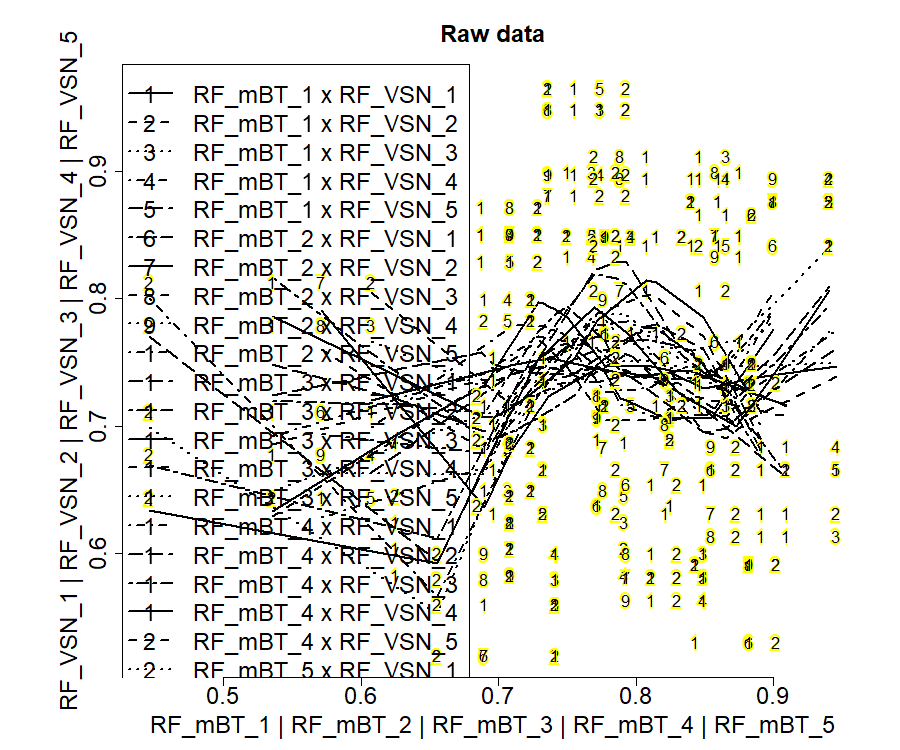
```


## Distribution of original data

### - density plots
```{r, echo=FALSE, out.width = "90%"}
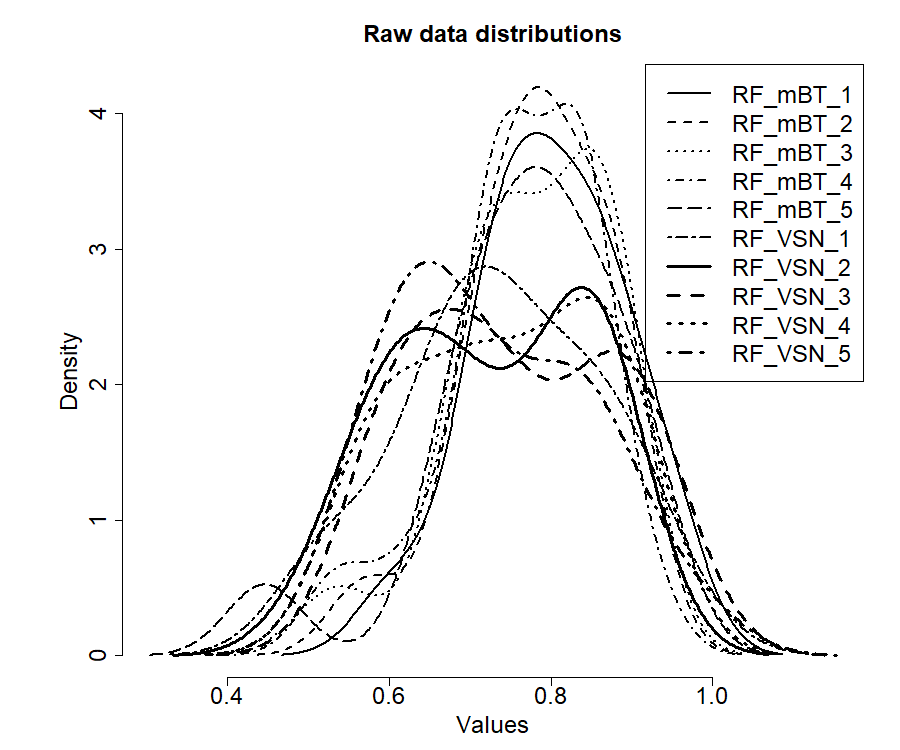
```

```{r, echo=FALSE, out.width = "90%"}
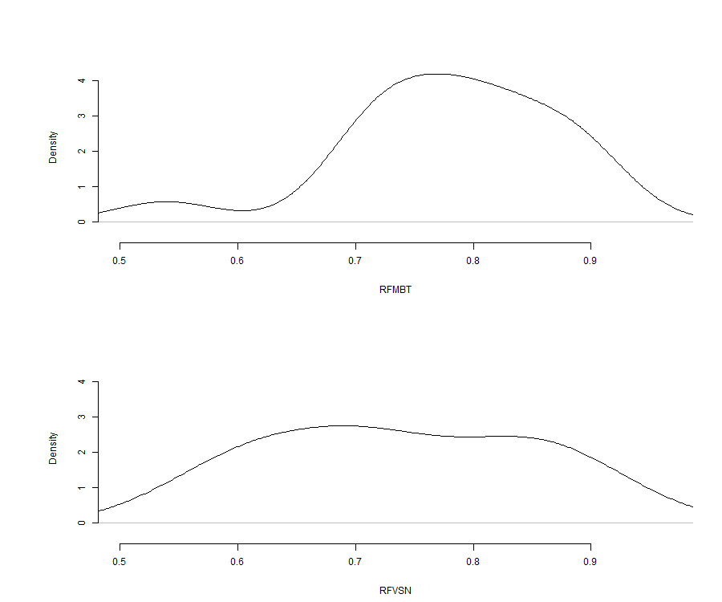
```


### - boxplots
```{r, echo=FALSE, out.width = "90%"}
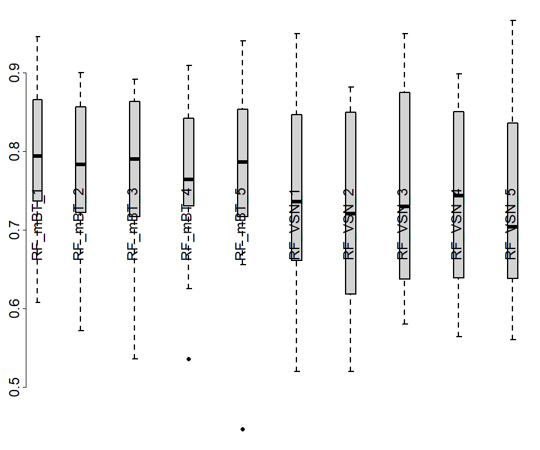
```

```{r, echo=FALSE, out.width = "90%"}
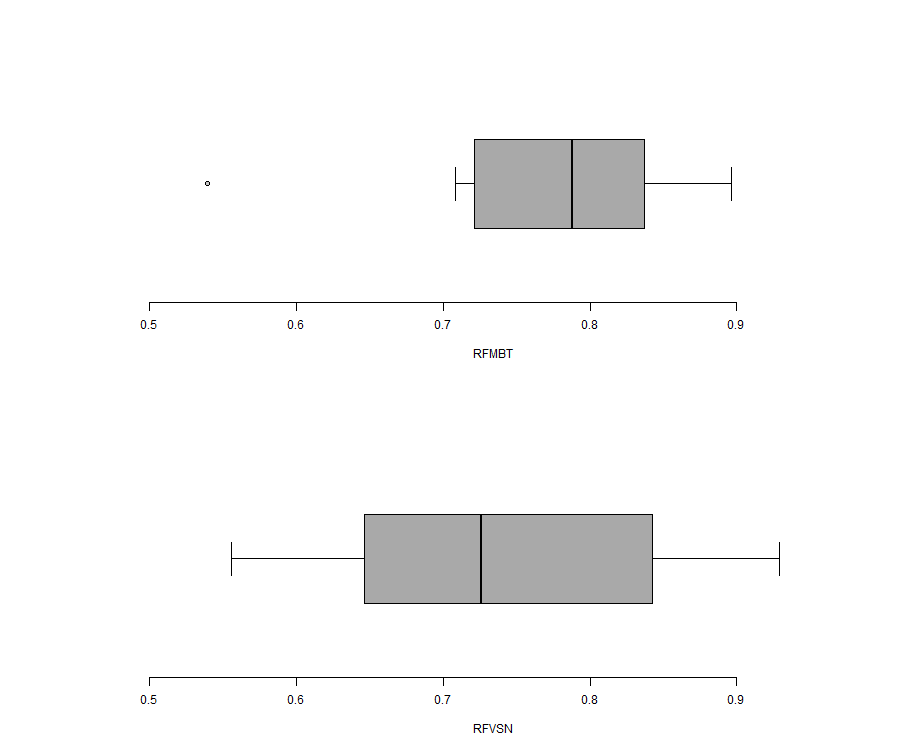
```


### - bagplot
```{r, echo=FALSE, out.width = "90%"}
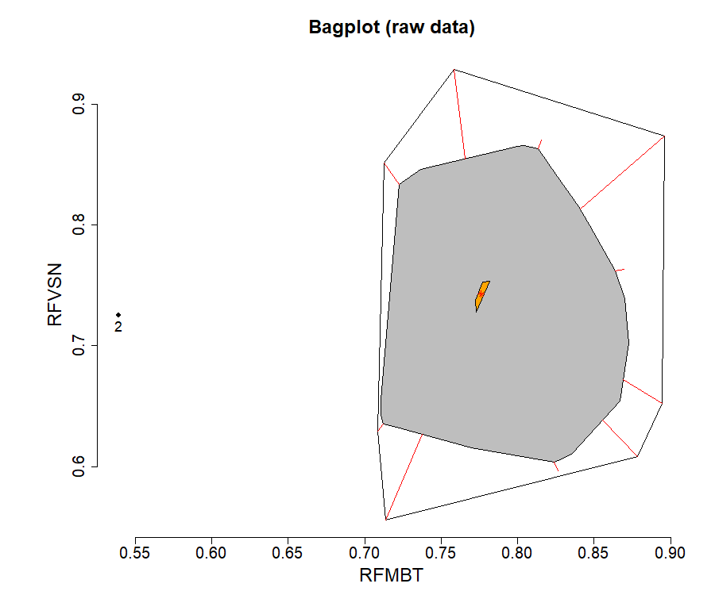
```


## Robust ordinary least square linear regression
```{r, echo=FALSE, out.width = "90%"}
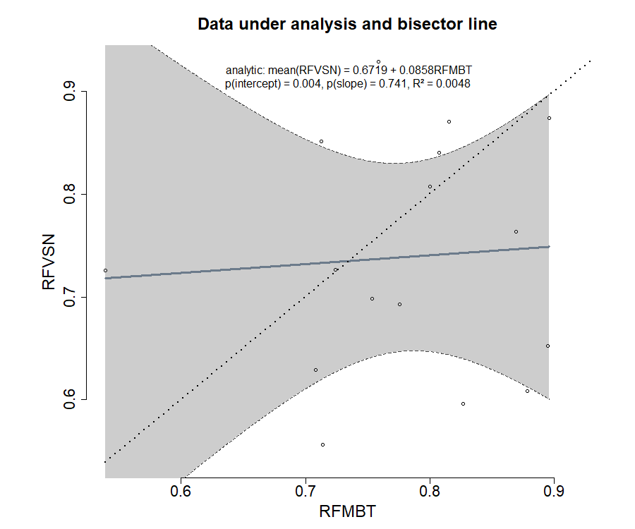
```


## Classical Bland and Altman plot method

### raw data
```{r, echo=FALSE, out.width = "90%"}
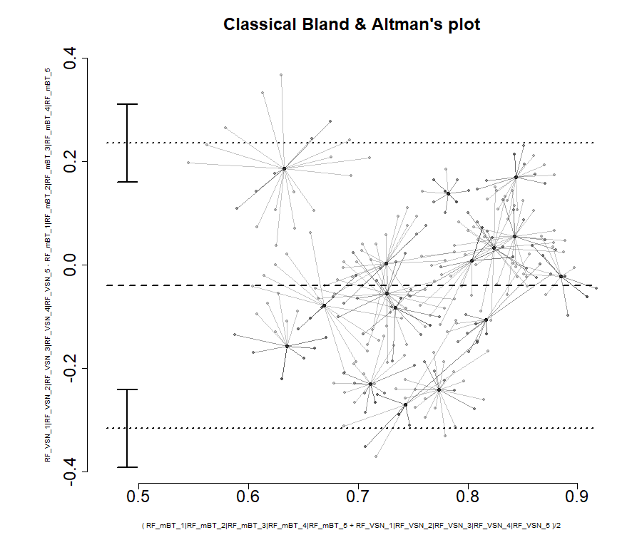
```


### data under analysis
```{r, echo=FALSE, out.width = "90%"}
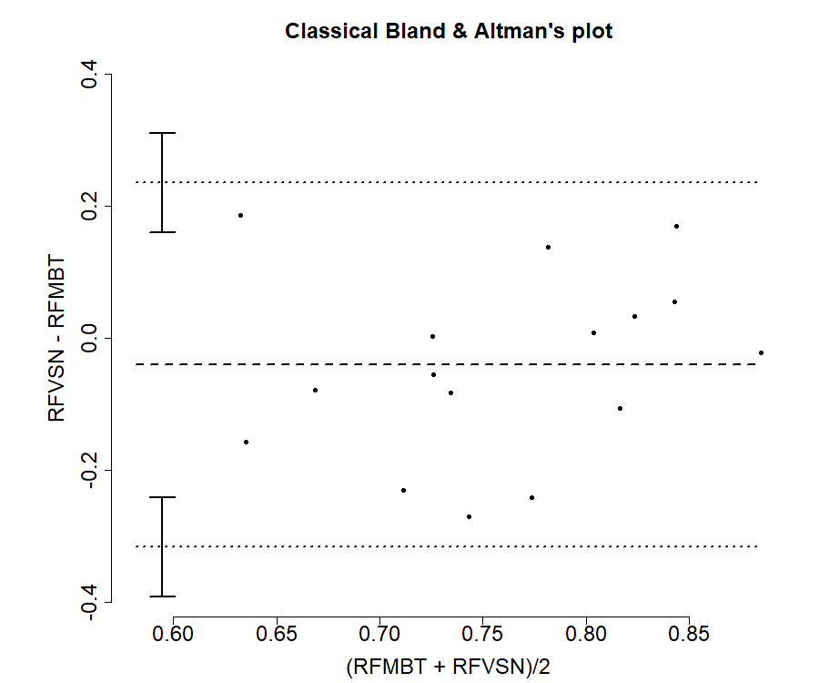
```


<pre>
             estimate
mean.diff -0.04076992
lowerLoA  -0.31685240
upperLoA   0.23531256
ciLoA      0.07505815
alpha      0.05000000
</pre>

\clearpage
# Test of structural accuracy

<pre>
Hedberg, EC, Ayers, S (2015) The power of a paired t-test
with a covariate. Social Science Research 50: 277-91

-------
- model
-------
	IV = RFMBT - mean(RFMBT)
	DV = RFVSN - RFMBT

------------------------------
- functional analytic approach
------------------------------

Call: estimatr::lm_robust(formula = DV ~ IV)

Standard error type:	HC2

Coefficients:
              Estimate   Std. Error   t value   Pr(>|t|)   CI Lower   CI Upper   DF
(Intercept)     -0.041        0.029    -1.408      0.181     -0.103      0.02114.000
         IV     -0.914        0.255    -3.591      0.003     -1.460     -0.36814.000


Multiple R-squared: 0.3512,  Adjusted R-squared: 0.3049
F-statistic: 12.9 on 1 and 14 DF, p-value: 0.002951

Decision (analytic):

	H0: equal structural means between methods is not rejected
	(p = 0.1809)

Decision by 95% confidence interval:
	avg{RFVSN - RFMBT} = -0.0408 + -0.9142 {RFMBT - mean(RFMBT)}

	H0: accuracy point(0,0) inside 95% CI [-0.1323, 0.0507] is not rejected
	n: 16 data pairs
	Bias 95%CI: between -0.1323 and 0.0507.

</pre>
```{r, echo=FALSE, out.width = "90%"}
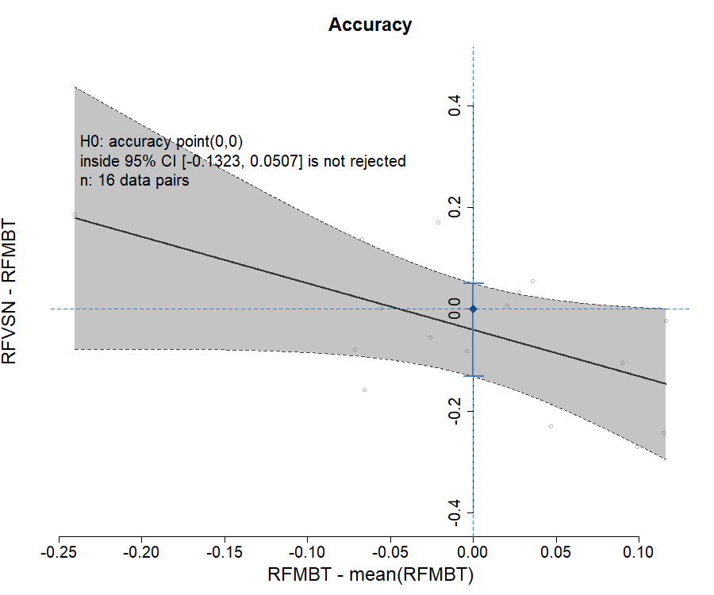
```


\clearpage
# Test of structural precision

<pre>

-------------
- lambda test
-------------
 
 Francq B, Berger M (2019). 
BivRegBLS: Tolerance Interval and EIV Regression -
Method Comparison Studies_. R package version 1.1.1,
https://CRAN.R-project.org/package=BivRegBLS

Chapter 303, NCSS 11 (2016): Deming regression
https://www.ncss.com/wp-content/themes/ncss/pdf/
	Procedures/NCSS/Deming_Regression.pdf

Assuming repeated measures per method:
	- reference method (5): RFMBT (RF_mBT_1, RF_mBT_2, RF_mBT_3, RF_mBT_4, RF_mBT_5)
	- putative method (5): RFVSN (RF_VSN_1, RF_VSN_2, RF_VSN_3, RF_VSN_4, RF_VSN_5)
 
 lambda = V[delta]/V[epsilon] = 1 is not rejected
</pre>

<pre>

Shukla, GK (1973) Some exact tests on hypothesis
about Grubbs estimators. Biometrics 29: 373-377

-------
- model
-------
	IV = (RFMBT + RFVSN) / 2
	DV = RFVSN - RFMBT

------------------------------
- functional analytic approach
------------------------------

Call: estimatr::lm_robust(formula = DV ~ IV)

Standard error type:	HC2

Coefficients:
              Estimate   Std. Error   t value   Pr(>|t|)   CI Lower   CI Upper   DF
(Intercept)     -0.348        0.436    -0.798      0.438     -1.283      0.58714.000
         IV      0.405        0.554     0.730      0.477     -0.784      1.59314.000


Multiple R-squared: 0.0469,  Adjusted R-squared: -0.0212
F-statistic: 0.5 on 1 and 14 DF, p-value: 0.477147

Decision (analytic):

	H0: equal structural precisions between methods is not rejected
	(p = 0.4771)

Decision by 95% confidence band:
	avg{RFVSN - RFMBT} = -0.348 + 0.4047 {(RFMBT + RFVSN)/2}

	H0: precision line horizontal (x,0)
	with translation from -0.1323 to 0.0507 inside 95% CB is not rejected
	n: 16 data pairs
</pre>
```{r, echo=FALSE, out.width = "90%"}
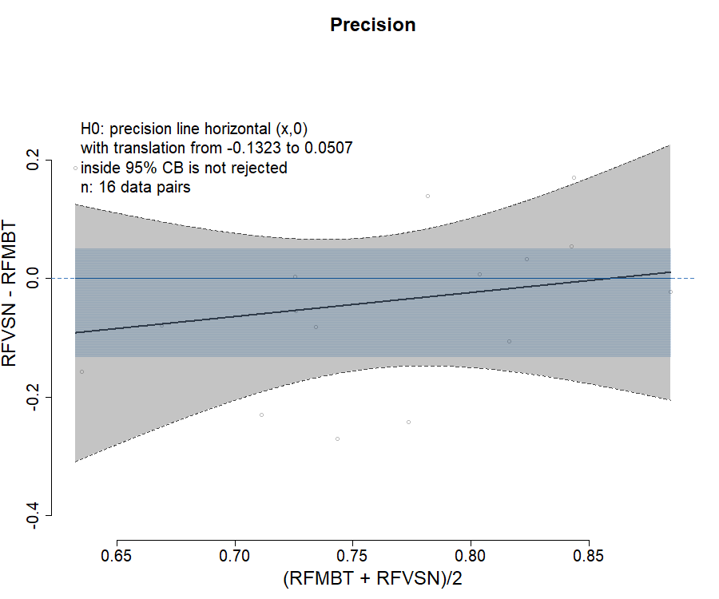
```


\clearpage
# Test of structural reliability

## structural bisector line

<pre>
Creasy, MA (1956) Confidence Limits for the Gradient
in the Linear Functional Relationship. Journal of the 
Royal Statistical Society 18(1):65-69

Glaister, P (2001) Least squares revisited.
The Mathematical Gazette 85(502): 104-107.

-------
- model
-------

	X = True[RFMBT]
	Y = True[RFVSN]

Deming regression for reliability
	Y = intercept + slope . X

------------------------------
- functional analytic approach
------------------------------

Decision by 95% confidence band:
	avg{True[RFVSN]} = -1.1024 + 2.3619 {True[RFMBT]}

	H0: reliability line IV=DV
	with translation from -0.1323 to 0.0507 inside 95% CB is not rejected
lambda = 1.399022
	n: 16 data pairs
</pre>
```{r, echo=FALSE, out.width = "90%"}
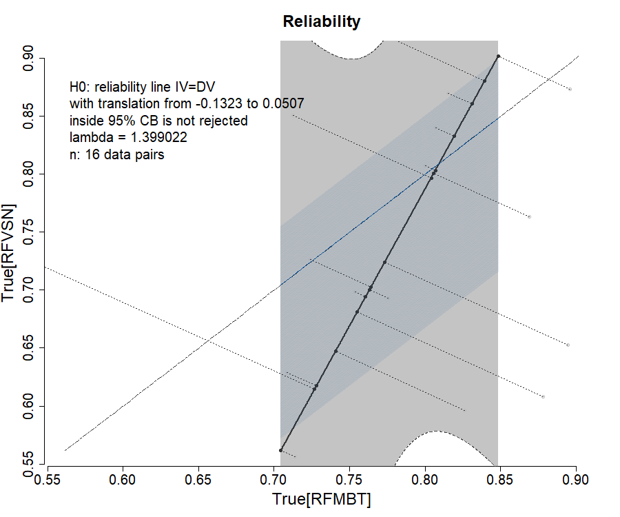
```


## structural confidence elliptical region

<pre>


Decision by 95% confidence ellipse:

	H0: intercept = [-0.1323,0.0507], slope = 1 inside 95% ellipse is not rejected
	n: 16 data pairs
</pre>
```{r, echo=FALSE, out.width = "90%"}
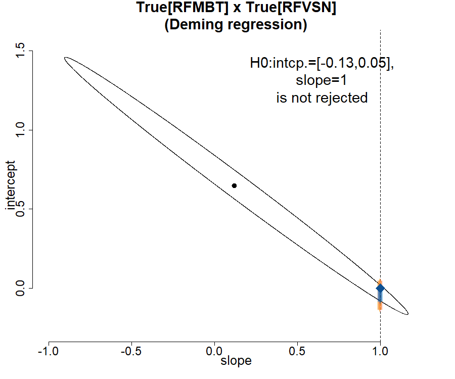
```

