<!-- version -->
<div align=right>
<font style="color:#26a169; font-size:80%">Processed: 2024.08.30 13:49</font>
</div>

```{r setup, include=FALSE}
knitr::opts_chunk$set(echo = TRUE, 
fig.width=7, fig.height=6,
fig.align = "center",
comment = NA)
```

```{css, echo=FALSE}
.bgobs {
  background-color: #f5e9ab;
 }
.bgcodigo {
  background-color: #94a6aa;
 }
.bgsaida {
  background-color: #ecf7db;
 }
```


\clearpage
# Descriptive statistics

<pre>

  ----------
  - raw data
  ----------
     CNN_mBT_1   CNN_mBT_2   CNN_mBT_3   CNN_mBT_4   CNN_mBT_5   CNN_VSN_1   CNN_VSN_2   CNN_VSN_3   CNN_VSN_4   CNN_VSN_5
 1         0.7         0.8         0.8         0.7         0.8         0.9         1.0         0.9         0.9         0.9
 2         0.7         0.7         0.7         0.7         0.7         0.8         0.8         0.8         0.8         0.8
 3         0.8         1.0         1.0         0.9         1.0         0.9         0.9         0.9         0.9         0.8
 4         0.9         0.9         0.9         0.8         0.9         0.9         0.9         0.9         0.9         0.9
 5         0.8         1.0         0.9         0.9         0.9         0.9         0.9         0.9         1.0         0.9
 6         1.0         0.9         0.9         1.0         1.0         0.8         0.7         0.7         0.8         0.8
 7         1.0         1.0         0.9         1.0         0.9         0.9         0.9         1.0         0.9         0.9
 8         0.8         0.8         0.8         0.8         0.9         0.8         0.7         0.7         0.6         0.7
 9         0.8         0.7         0.8         0.7         0.7         0.9         0.7         0.8         0.8         0.7
10         0.7         0.7         0.7         0.7         0.6         0.9         0.8         0.9         0.8         0.9
11         0.9         0.9         0.9         0.9         0.8         0.8         0.8         0.9         0.7         0.8
12         0.9         0.9         0.9         1.0         0.9         0.8         0.7         0.8         0.8         0.8
13         1.0         0.9         1.0         0.9         0.9         0.9         0.9         0.9         0.9         0.9
14         1.0         0.9         0.9         1.0         0.9         0.9         0.9         0.9         1.0         0.9
15         0.8         0.8         0.8         0.8         0.8         0.8         0.7         0.7         0.9         0.8
16         0.9         0.8         0.8         0.8         0.9         1.0         1.0         1.0         1.0         0.9

   ---------
   - summary
   ---------
             CNN_mBT_1      CNN_mBT_2      CNN_mBT_3      CNN_mBT_4      CNN_mBT_5      CNN_VSN_1      CNN_VSN_2      CNN_VSN_3      CNN_VSN_4      CNN_VSN_5
   Min.     Min.0.6897     Min.0.6552     Min.0.6964     Min.0.7069     Min.0.6207     Min.0.7586     Min.0.6667     Min.0.6667     Min.0.6458     Min.0.6667
1st Qu.   1stQu.0.7857   1stQu.0.7689   1stQu.0.7768   1stQu.0.7649   1stQu.0.7861   1stQu.0.8324   1stQu.0.7383   1stQu.0.8007   1stQu.0.7799   1stQu.0.8181
 Median   Median0.8516   Median0.8727   Median0.8634   Median0.8497   Median0.8661   Median0.8834   Median0.8540   Median0.8750   Median0.8720   Median0.8452
3rd Qu.   3rdQu.0.9374   3rdQu.0.9427   3rdQu.0.9086   3rdQu.0.9481   3rdQu.0.9327   3rdQu.0.9167   3rdQu.0.9307   3rdQu.0.9014   3rdQu.0.9478   3rdQu.0.8892
   Max.     Max.0.9811     Max.0.9623     Max.0.9811     Max.0.9825     Max.0.9636     Max.0.9833     Max.0.9833     Max.0.9831     Max.0.9667     Max.0.9500
   Mean     Mean0.8532     Mean0.8461     Mean0.8474     Mean0.8527     Mean0.8514     Mean0.8767     Mean0.8374     Mean0.8481     Mean0.8532     Mean0.8408
   s.d.             NA          0.117          0.131          0.089          0.118          0.101          0.091          0.127          0.102          0.135
      n             16             16             16             16             16             16             16             16             16             16
     NA              0              0              0              0              0              0              0              0              0              0

  ---------------------
  - data under analysis
  ---------------------
     CNNMBT   CNNVSN
 1      0.8      0.9
 2      0.7      0.8
 3      0.9      0.9
 4      0.9      0.9
 5      0.9      0.9
 6      0.9      0.7
 7      1.0      0.9
 8      0.8      0.7
 9      0.7      0.8
10      0.7      0.8
11      0.9      0.8
12      0.9      0.8
13      1.0      0.9
14      0.9      0.9
15      0.8      0.8
16      0.8      1.0

   ---------
   - summary
   ---------
                CNNMBT         CNNVSN
   Min.     Min.0.6793     Min.0.7125
1st Qu.   1stQu.0.7875   1stQu.0.7973
 Median   Median0.8604   Median0.8529
3rd Qu.   3rdQu.0.9397   3rdQu.0.9237
   Max.     Max.0.9569     Max.0.9700
   Mean     Mean0.8501     Mean0.8513
   s.d.          0.094          0.077
      n             16             16
     NA              0              0

</pre>

<pre>

Lambda = 1.880366 [1.146925,3.082832]

</pre>

## Traditional correlation

<pre>

	Pearson's product-moment correlation

data:  as.numeric(unlist(data[, 1])) and as.numeric(unlist(data[, 2]))
t = 0.71672, df = 14, p-value = 0.4853
alternative hypothesis: true correlation is not equal to 0
95 percent confidence interval:
 -0.3392076  0.6255037
sample estimates:
      cor 
0.1881314 

</pre>

## Raw data
```{r, echo=FALSE, out.width = "90%"}
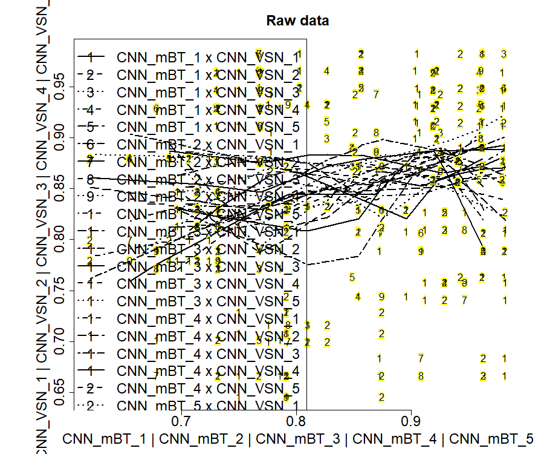
```


## Distribution of original data

### - density plots
```{r, echo=FALSE, out.width = "90%"}
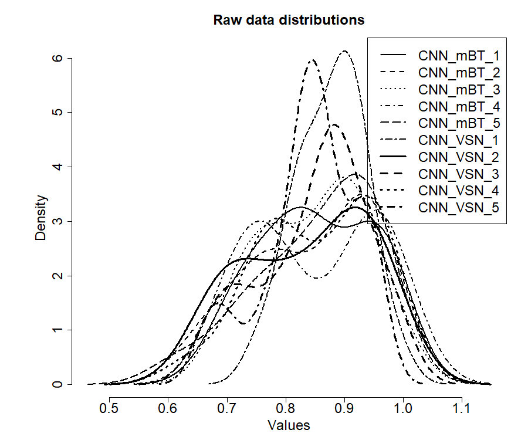
```

```{r, echo=FALSE, out.width = "90%"}
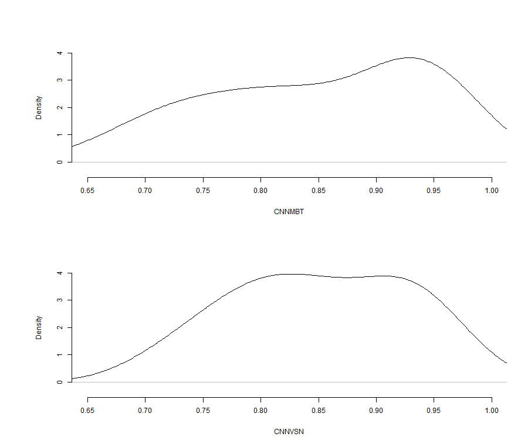
```


### - boxplots
```{r, echo=FALSE, out.width = "90%"}
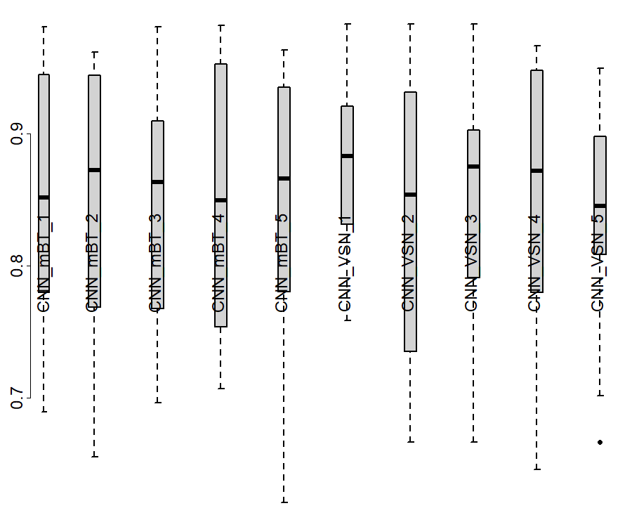
```

```{r, echo=FALSE, out.width = "90%"}
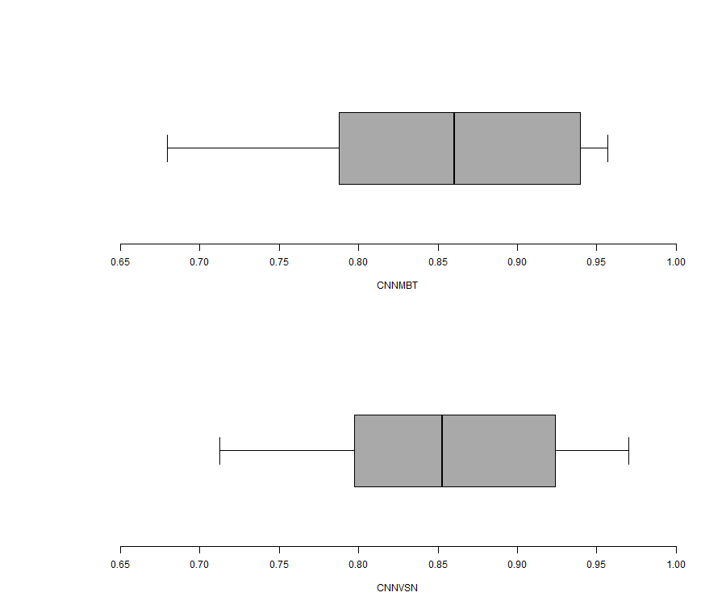
```


### - bagplot
```{r, echo=FALSE, out.width = "90%"}
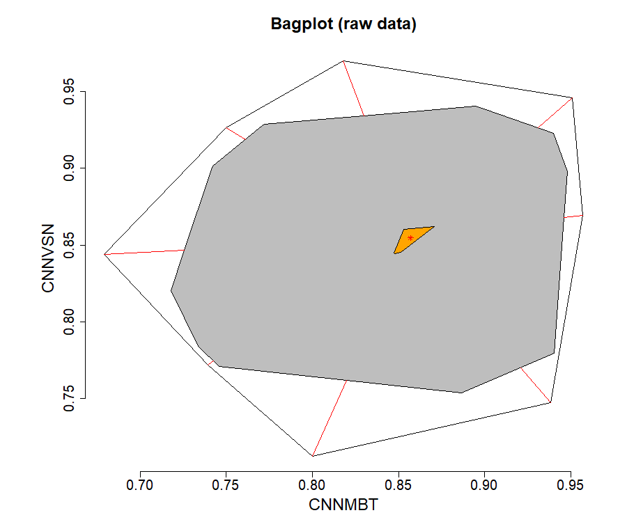
```


## Robust ordinary least square linear regression
```{r, echo=FALSE, out.width = "90%"}
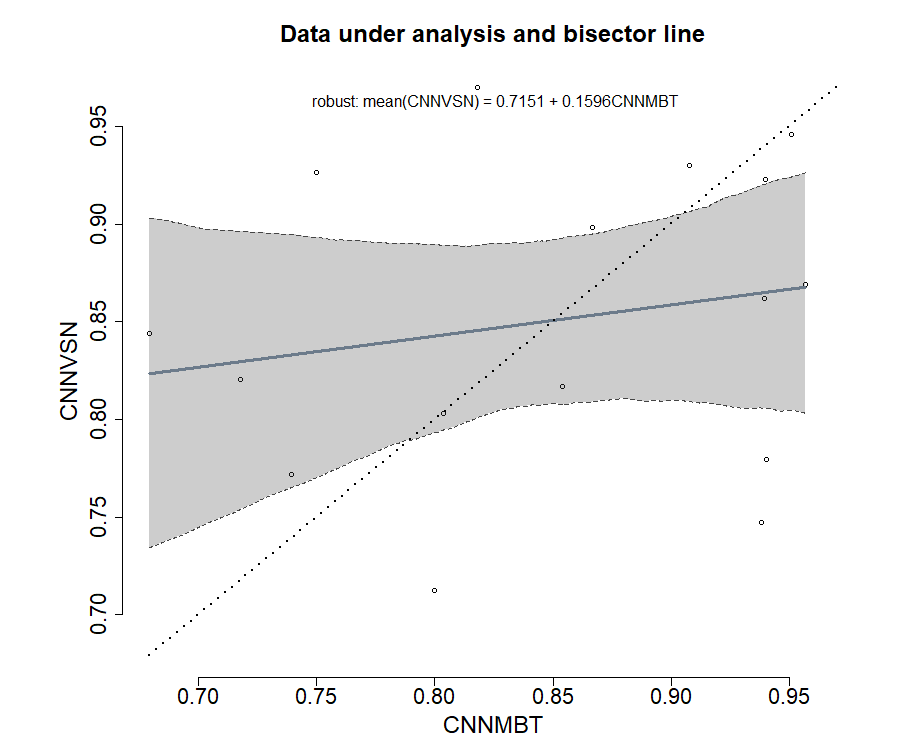
```


## Classical Bland and Altman plot method

### raw data
```{r, echo=FALSE, out.width = "90%"}
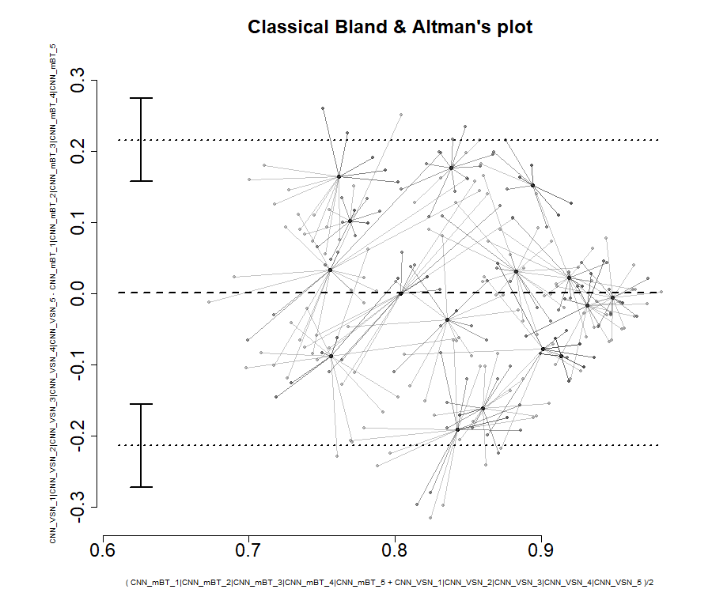
```


### data under analysis
```{r, echo=FALSE, out.width = "90%"}
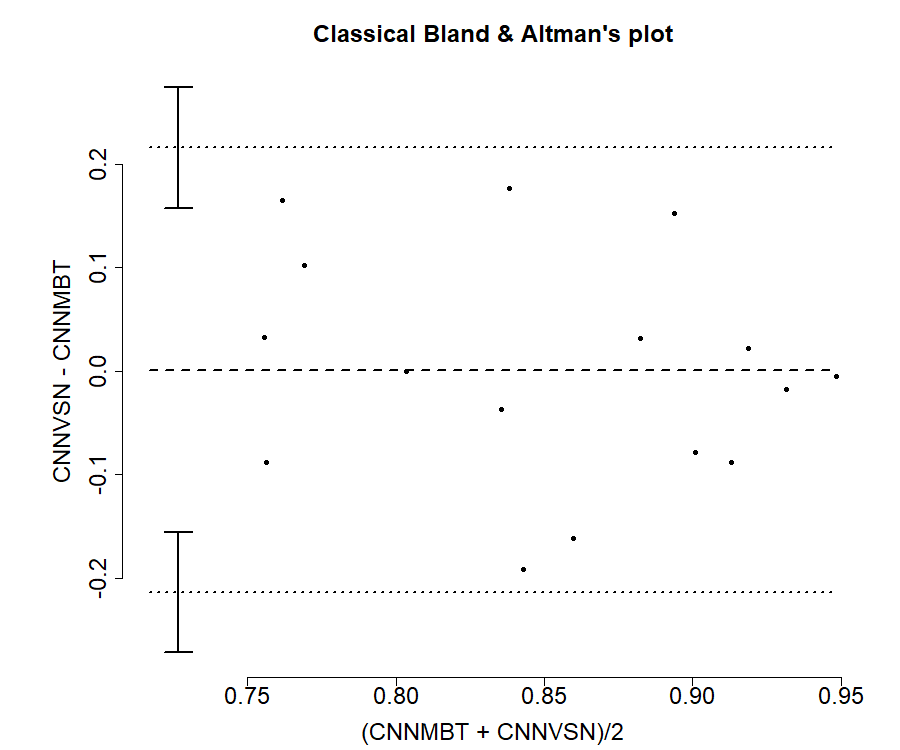
```


<pre>
              estimate
mean.diff  0.001110066
lowerLoA  -0.213477894
upperLoA   0.215698025
ciLoA      0.058339721
alpha      0.050000000
</pre>

\clearpage
# Test of structural accuracy

<pre>
Hedberg, EC, Ayers, S (2015) The power of a paired t-test
with a covariate. Social Science Research 50: 277-91

-------
- model
-------
	IV = CNNMBT - mean(CNNMBT)
	DV = CNNVSN - CNNMBT

----------------------------
- functional robust approach
----------------------------

Decision by 95% confidence interval:
	avg{CNNVSN - CNNMBT} = 2e-04 + -0.8397 {CNNMBT - mean(CNNMBT)}

	H0: accuracy point(0,0) inside 95% CI [-0.0436, 0.0454] is not rejected
	n: 16 data pairs
	bootstrapping: 2000 resamplings
	Bias 95%CI: between -0.0436 and 0.0454.

</pre>
```{r, echo=FALSE, out.width = "90%"}
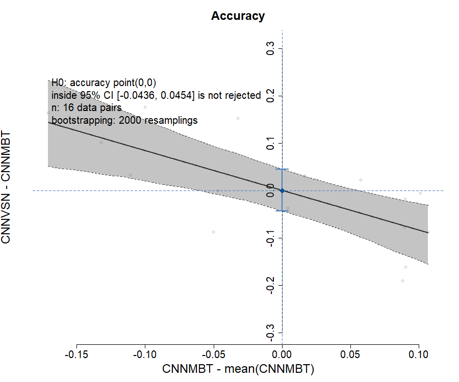
```


\clearpage
# Test of structural precision

<pre>

-------------
- lambda test
-------------
 
 Francq B, Berger M (2019). 
BivRegBLS: Tolerance Interval and EIV Regression -
Method Comparison Studies_. R package version 1.1.1,
https://CRAN.R-project.org/package=BivRegBLS

Chapter 303, NCSS 11 (2016): Deming regression
https://www.ncss.com/wp-content/themes/ncss/pdf/
	Procedures/NCSS/Deming_Regression.pdf

Assuming repeated measures per method:
	- reference method (5): CNNMBT (CNN_mBT_1, CNN_mBT_2, CNN_mBT_3, CNN_mBT_4, CNN_mBT_5)
	- putative method (5): CNNVSN (CNN_VSN_1, CNN_VSN_2, CNN_VSN_3, CNN_VSN_4, CNN_VSN_5)
 
 lambda = V[delta]/V[epsilon] = 1 is  rejected
</pre>

<pre>

Shukla, GK (1973) Some exact tests on hypothesis
about Grubbs estimators. Biometrics 29: 373-377

-------
- model
-------
	IV = (CNNMBT + CNNVSN) / 2
	DV = CNNVSN - CNNMBT

----------------------------
- functional robust approach
----------------------------

Decision by 95% confidence band:
	avg{CNNVSN - CNNMBT} = 0.2806 + -0.3221 {(CNNMBT + CNNVSN)/2}

	H0: precision line horizontal (x,0)
	with translation from -0.0436 to 0.0454 inside 95% CB is not rejected
	n: 16 data pairs
	bootstrapping: 2000 resamplings
</pre>
```{r, echo=FALSE, out.width = "90%"}
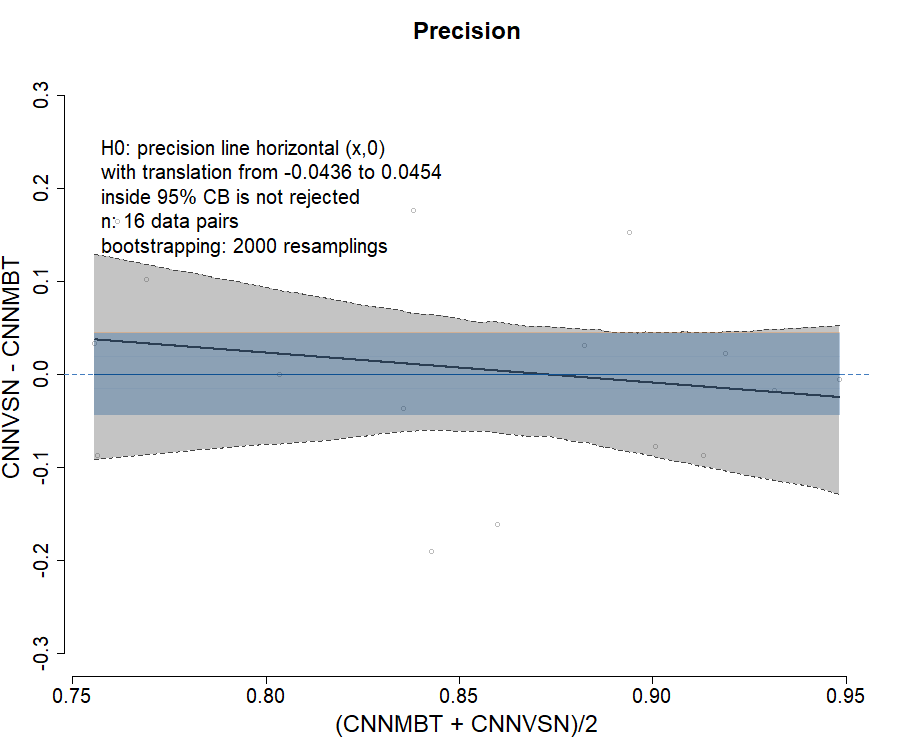
```


\clearpage
# Test of structural reliability

## structural bisector line

<pre>
Creasy, MA (1956) Confidence Limits for the Gradient
in the Linear Functional Relationship. Journal of the 
Royal Statistical Society 18(1):65-69

Glaister, P (2001) Least squares revisited.
The Mathematical Gazette 85(502): 104-107.

-------
- model
-------

	X = True[CNNMBT]
	Y = True[CNNVSN]

Deming regression for reliability
	Y = intercept + slope . X

----------------------------
- functional robust approach
----------------------------

Decision by 95% confidence band:
	avg{True[CNNVSN]} = 0.6568 + 0.2265 {True[CNNMBT]}

	H0: reliability line IV=DV
	with translation from -0.0436 to 0.0454 inside 95% CB is not rejected
lambda = 1.880366
	n: 16 data pairs
	bootstrapping: 2000 resamplings
</pre>
```{r, echo=FALSE, out.width = "90%"}
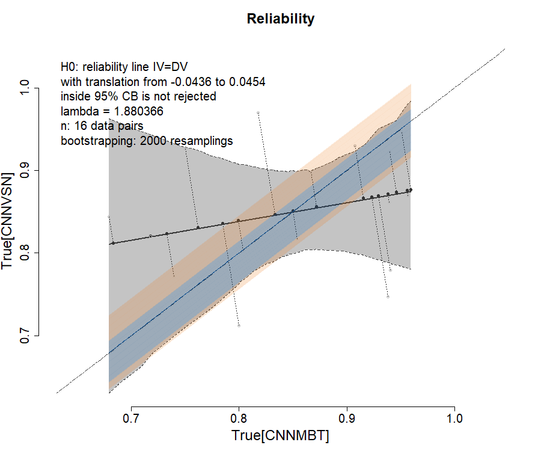
```


## structural confidence elliptical region

<pre>


Decision by 95% confidence ellipse:

	H0: intercept = [-0.0436,0.0454], slope = 1 inside 95% ellipse is not rejected
	n: 16 data pairs
	bootstrapping: 2000 resamplings
</pre>
```{r, echo=FALSE, out.width = "90%"}
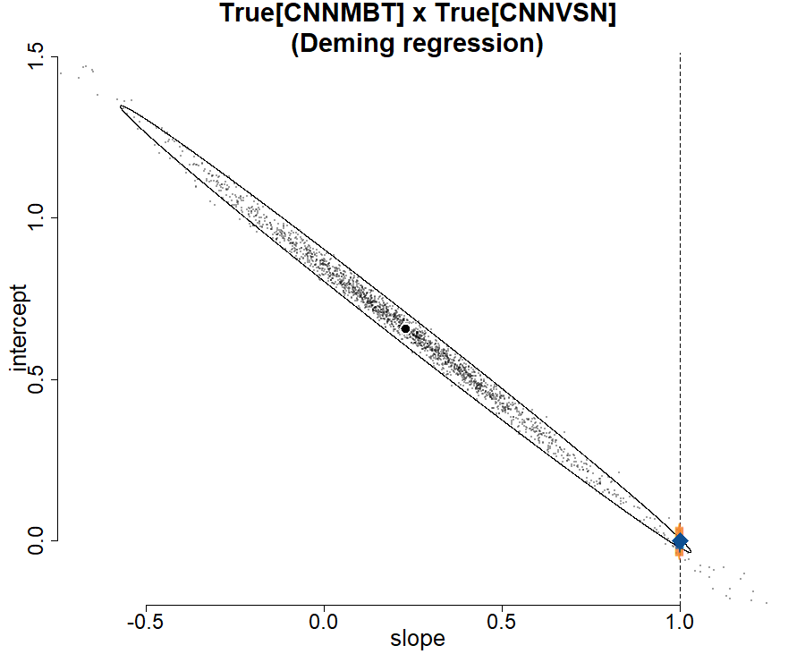
```

