<!-- version -->
<div align=right>
<font style="color:#26a169; font-size:80%">Processed: 2024.08.30 14:24</font>
</div>

```{r setup, include=FALSE}
knitr::opts_chunk$set(echo = TRUE, 
fig.width=7, fig.height=6,
fig.align = "center",
comment = NA)
```

```{css, echo=FALSE}
.bgobs {
  background-color: #f5e9ab;
 }
.bgcodigo {
  background-color: #94a6aa;
 }
.bgsaida {
  background-color: #ecf7db;
 }
```


\clearpage
# Descriptive statistics

<pre>

  ----------
  - raw data
  ----------
     SVM_mBT   RF_mBT   CNN_mBT   SVM_VSN   RF_VSN   CNN_VSN
 1       0.8      0.8       0.8       0.9      0.9       0.9
 2       0.7      0.5       0.7       0.7      0.7       0.8
 3       0.9      0.8       0.9       0.7      0.6       0.9
 4       0.8      0.8       0.9       0.9      0.8       0.9
 5       0.9      0.9       0.9       0.8      0.8       0.9
 6       0.9      0.9       0.9       0.7      0.7       0.7
 7       0.8      0.8       1.0       0.9      0.9       0.9
 8       0.6      0.7       0.8       0.6      0.6       0.7
 9       0.8      0.8       0.7       0.8      0.7       0.8
10       0.6      0.7       0.7       0.7      0.6       0.8
11       0.7      0.7       0.9       0.7      0.9       0.8
12       0.9      0.8       0.9       0.8      0.7       0.8
13       0.9      0.9       1.0       0.8      0.6       0.9
14       0.9      0.9       0.9       0.9      0.9       0.9
15       0.8      0.7       0.8       0.7      0.7       0.8
16       0.8      0.8       0.8       0.9      0.8       1.0

   ---------
   - summary
   ---------
               SVM_mBT         RF_mBT        CNN_mBT        SVM_VSN         RF_VSN        CNN_VSN
   Min.     Min.0.5833     Min.0.5393     Min.0.6793     Min.0.5500     Min.0.5560     Min.0.7125
1st Qu.   1stQu.0.7524   1stQu.0.7216   1stQu.0.7875   1stQu.0.7219   1stQu.0.6468   1stQu.0.7973
 Median   Median0.8130   Median0.7877   Median0.8604   Median0.7530   Median0.7260   Median0.8529
3rd Qu.   3rdQu.0.8873   3rdQu.0.8371   3rdQu.0.9397   3rdQu.0.8700   3rdQu.0.8428   3rdQu.0.9237
   Max.     Max.0.9176     Max.0.8960     Max.0.9569     Max.0.9000     Max.0.9288     Max.0.9700
   Mean     Mean0.7981     Mean0.7795     Mean0.8501     Mean0.7725     Mean0.7388     Mean0.8513
   s.d.             NA          0.103          0.103          0.114          0.091          0.077
      n             16             16             16             16             16             16
     NA              0              0              0              0              0              0

  ---------------------
  - data under analysis
  ---------------------
     MBT   SVN
 1   0.8   0.9
 2   0.6   0.8
 3   0.9   0.7
 4   0.8   0.9
 5   0.9   0.8
 6   0.9   0.7
 7   0.8   0.9
 8   0.7   0.6
 9   0.8   0.7
10   0.7   0.7
11   0.8   0.8
12   0.9   0.8
13   0.9   0.7
14   0.9   0.9
15   0.8   0.7
16   0.8   0.9

   ---------
   - summary
   ---------
                   MBT            SVN
   Min.     Min.0.6417     Min.0.6306
1st Qu.   1stQu.0.7595   1stQu.0.7324
 Median   Median0.8136   Median0.7555
3rd Qu.   3rdQu.0.8784   3rdQu.0.8661
   Max.     Max.0.9176     Max.0.9243
   Mean     Mean0.8093     Mean0.7875
   s.d.          0.087          0.089
      n             16             16
     NA              0              0

</pre>

<pre>

Lambda = 1.624706 [0.802424,3.289622]

</pre>

## Traditional correlation

<pre>

	Pearson's product-moment correlation

data:  as.numeric(unlist(data[, 1])) and as.numeric(unlist(data[, 2]))
t = 1.2144, df = 14, p-value = 0.2447
alternative hypothesis: true correlation is not equal to 0
95 percent confidence interval:
 -0.2207931  0.6976476
sample estimates:
      cor 
0.3086988 

</pre>

## Raw data
```{r, echo=FALSE, out.width = "90%"}
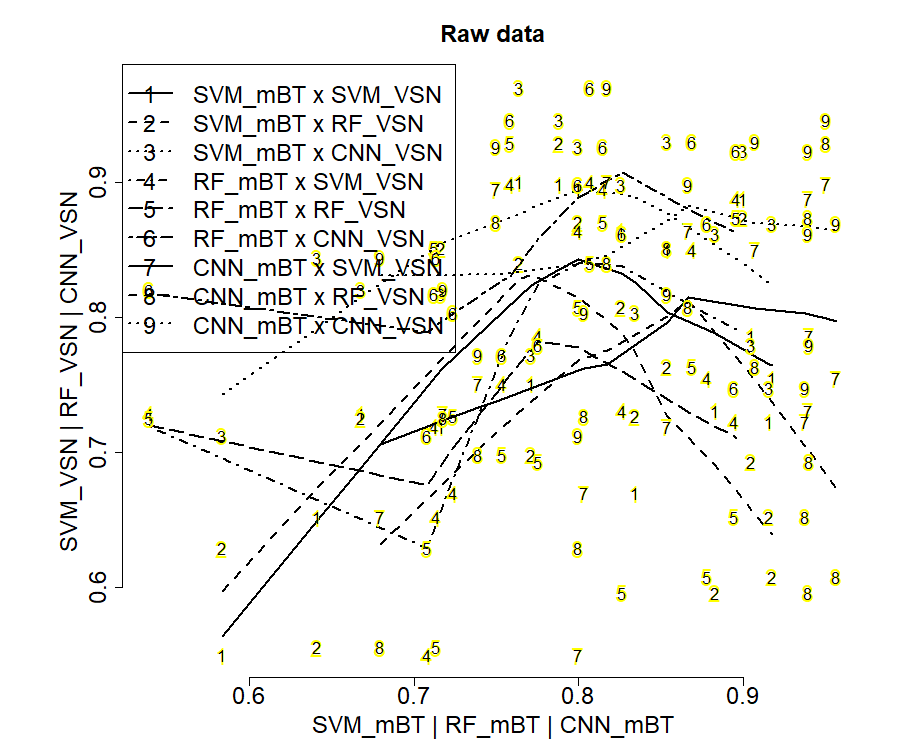
```


## Distribution of original data

### - density plots
```{r, echo=FALSE, out.width = "90%"}
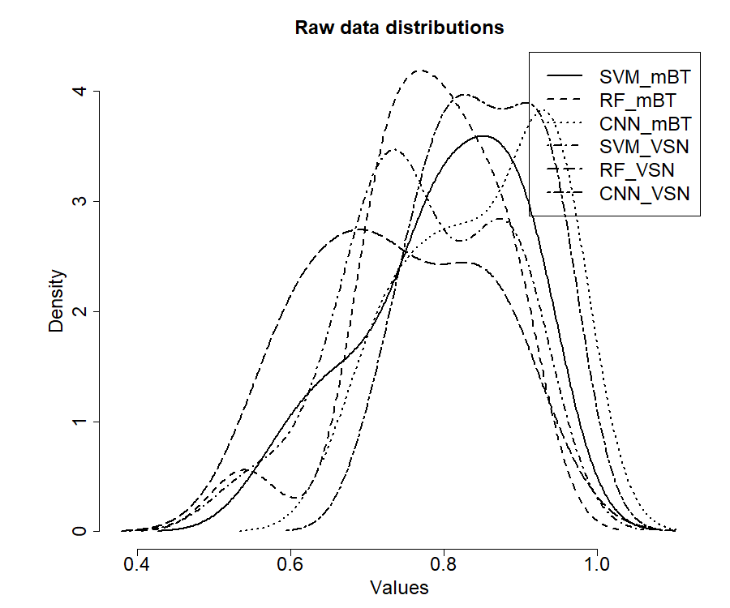
```

```{r, echo=FALSE, out.width = "90%"}
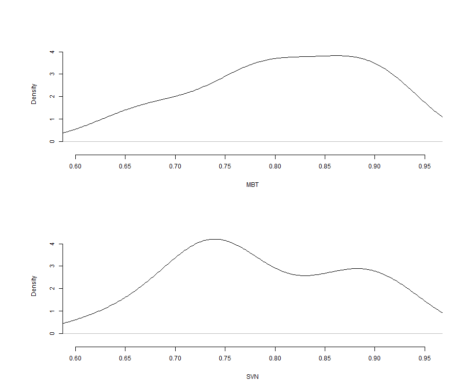
```


### - boxplots
```{r, echo=FALSE, out.width = "90%"}
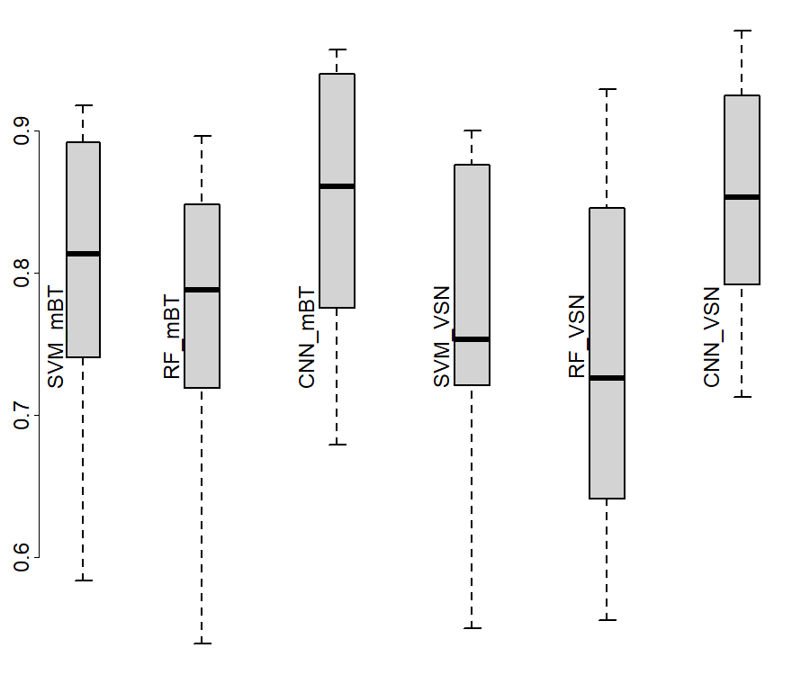
```

```{r, echo=FALSE, out.width = "90%"}
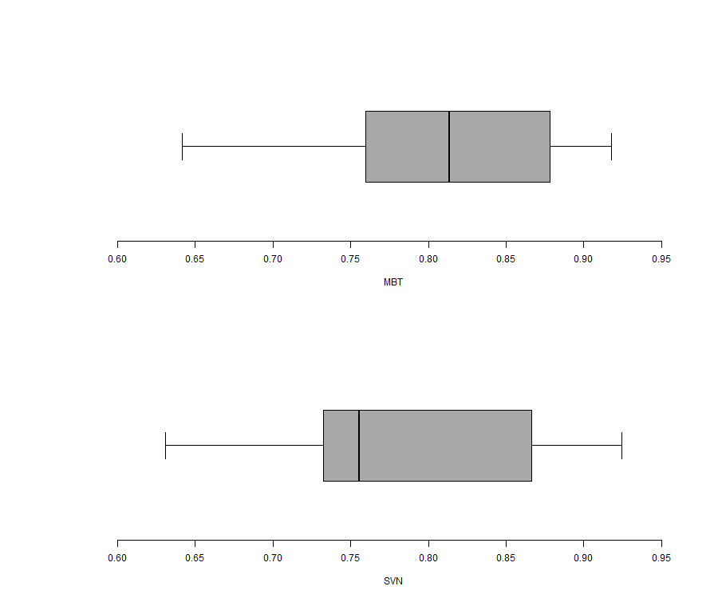
```


### - bagplot
```{r, echo=FALSE, out.width = "90%"}
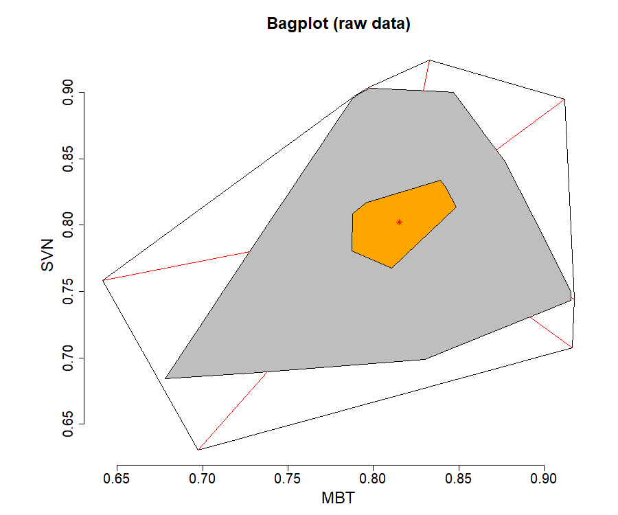
```


## Robust ordinary least square linear regression
```{r, echo=FALSE, out.width = "90%"}
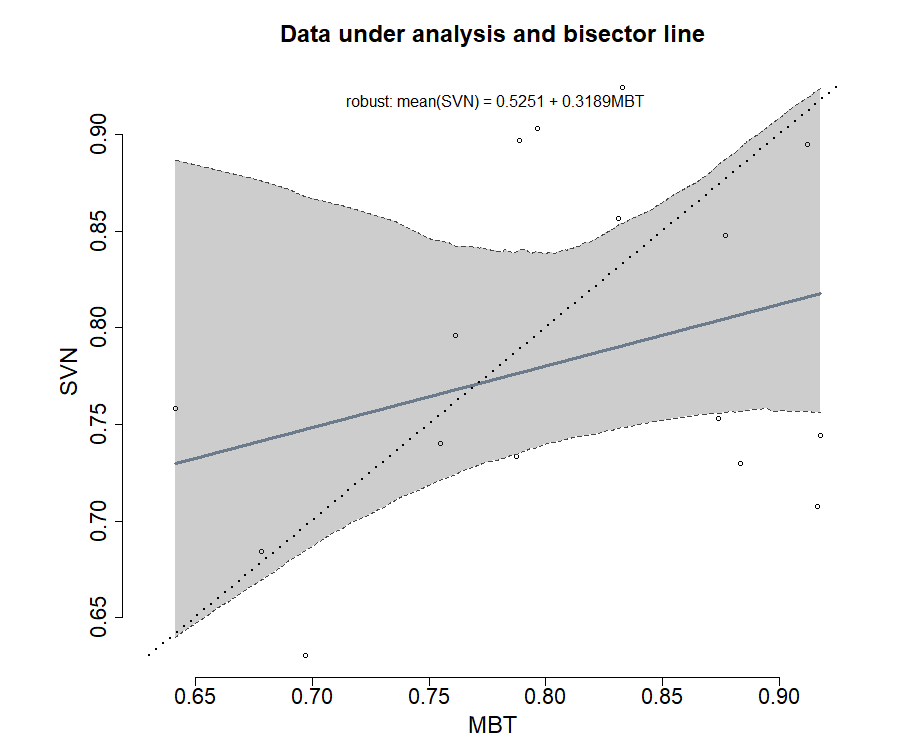
```


## Classical Bland and Altman plot method

### raw data
```{r, echo=FALSE, out.width = "90%"}
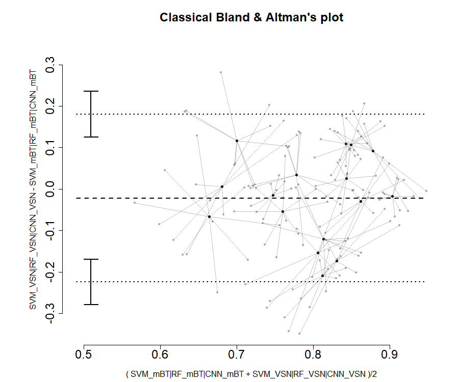
```


### data under analysis
```{r, echo=FALSE, out.width = "90%"}
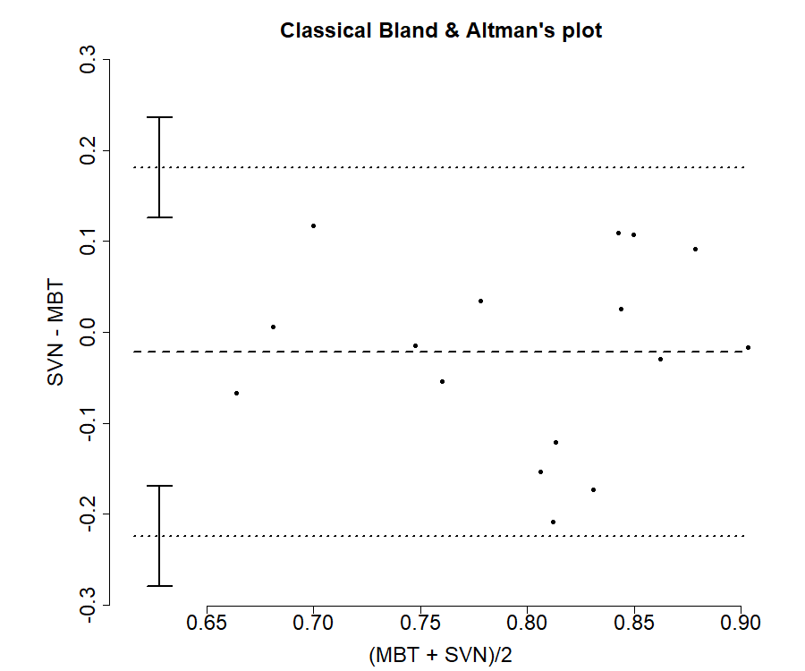
```


<pre>
             estimate
mean.diff -0.02174913
lowerLoA  -0.22417715
upperLoA   0.18067889
ciLoA      0.05503382
alpha      0.05000000
</pre>

\clearpage
# Test of structural accuracy

<pre>
Hedberg, EC, Ayers, S (2015) The power of a paired t-test
with a covariate. Social Science Research 50: 277-91

-------
- model
-------
	IV = MBT - mean(MBT)
	DV = SVN - MBT

----------------------------
- functional robust approach
----------------------------

Decision by 95% confidence interval:
	avg{SVN - MBT} = -0.019 + -0.6939 {MBT - mean(MBT)}

	H0: accuracy point(0,0) inside 95% CI [-0.0673, 0.0293] is not rejected
	n: 16 data pairs
	bootstrapping: 2000 resamplings
	Bias 95%CI: between -0.0673 and 0.0293.

</pre>
```{r, echo=FALSE, out.width = "90%"}
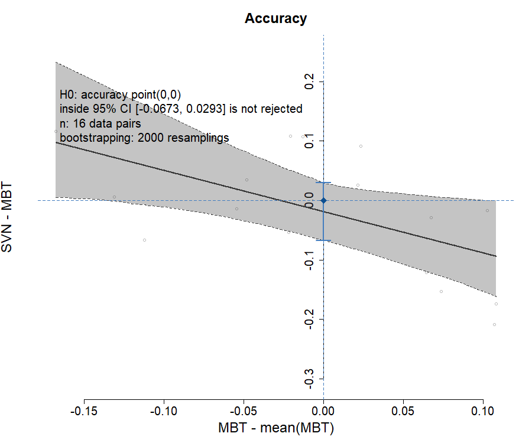
```


\clearpage
# Test of structural precision

<pre>

-------------
- lambda test
-------------
 
 Francq B, Berger M (2019). 
BivRegBLS: Tolerance Interval and EIV Regression -
Method Comparison Studies_. R package version 1.1.1,
https://CRAN.R-project.org/package=BivRegBLS

Chapter 303, NCSS 11 (2016): Deming regression
https://www.ncss.com/wp-content/themes/ncss/pdf/
	Procedures/NCSS/Deming_Regression.pdf

Assuming repeated measures per method:
	- reference method (3): MBT (SVM_mBT, RF_mBT, CNN_mBT)
	- putative method (3): SVN (SVM_VSN, RF_VSN, CNN_VSN)
 
 lambda = V[delta]/V[epsilon] = 1 is not rejected
</pre>

<pre>

Shukla, GK (1973) Some exact tests on hypothesis
about Grubbs estimators. Biometrics 29: 373-377

-------
- model
-------
	IV = (MBT + SVN) / 2
	DV = SVN - MBT

----------------------------
- functional robust approach
----------------------------

Decision by 95% confidence band:
	avg{SVN - MBT} = -0.0648 + 0.0533 {(MBT + SVN)/2}

	H0: precision line horizontal (x,0)
	with translation from -0.0673 to 0.0293 inside 95% CB is not rejected
	n: 16 data pairs
	bootstrapping: 2000 resamplings
</pre>
```{r, echo=FALSE, out.width = "90%"}
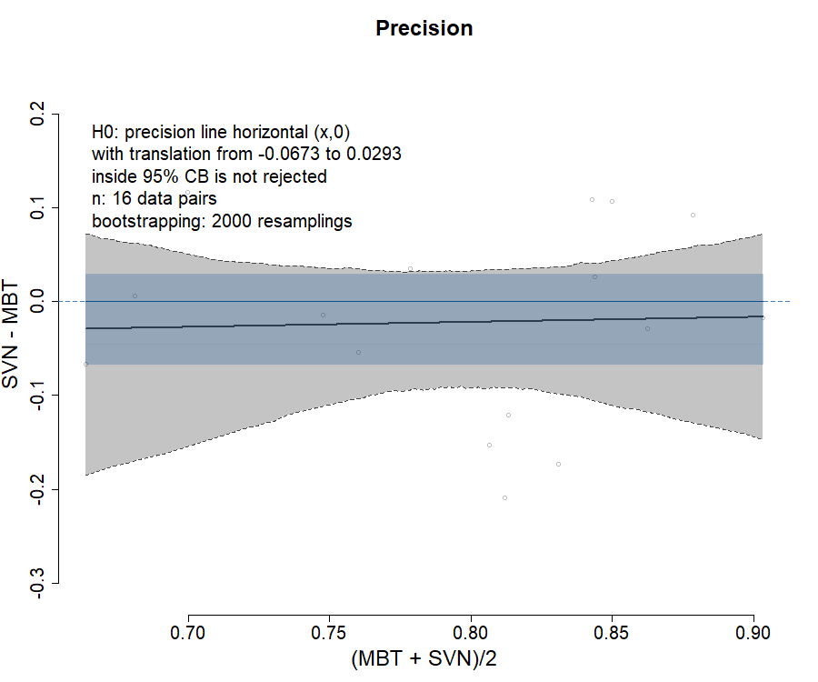
```


\clearpage
# Test of structural reliability

## structural bisector line

<pre>
Creasy, MA (1956) Confidence Limits for the Gradient
in the Linear Functional Relationship. Journal of the 
Royal Statistical Society 18(1):65-69

Glaister, P (2001) Least squares revisited.
The Mathematical Gazette 85(502): 104-107.

-------
- model
-------

	X = True[MBT]
	Y = True[SVN]

Deming regression for reliability
	Y = intercept + slope . X

----------------------------
- functional robust approach
----------------------------

Decision by 95% confidence band:
	avg{True[SVN]} = 0.271 + 0.6376 {True[MBT]}

	H0: reliability line IV=DV
	with translation from -0.0673 to 0.0293 inside 95% CB is not rejected
lambda = 1.624706
	n: 16 data pairs
	bootstrapping: 2000 resamplings
</pre>
```{r, echo=FALSE, out.width = "90%"}
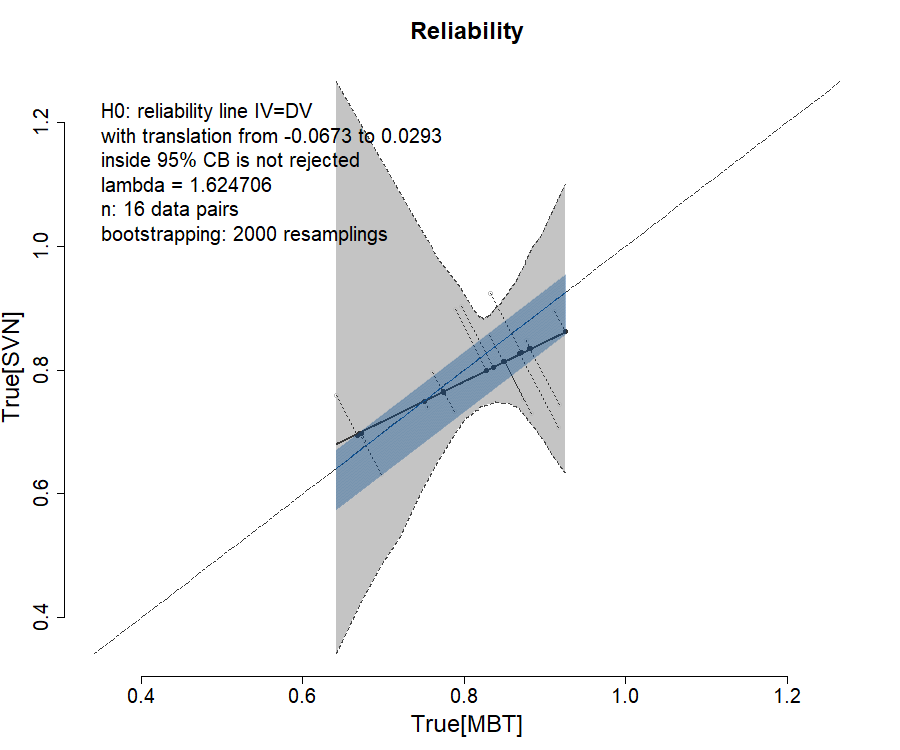
```


## structural confidence elliptical region

<pre>


Decision by 95% confidence ellipse:

	H0: intercept = [-0.0673,0.0293], slope = 1 inside 95% ellipse is not rejected
	n: 16 data pairs
	bootstrapping: 2000 resamplings
</pre>
```{r, echo=FALSE, out.width = "90%"}
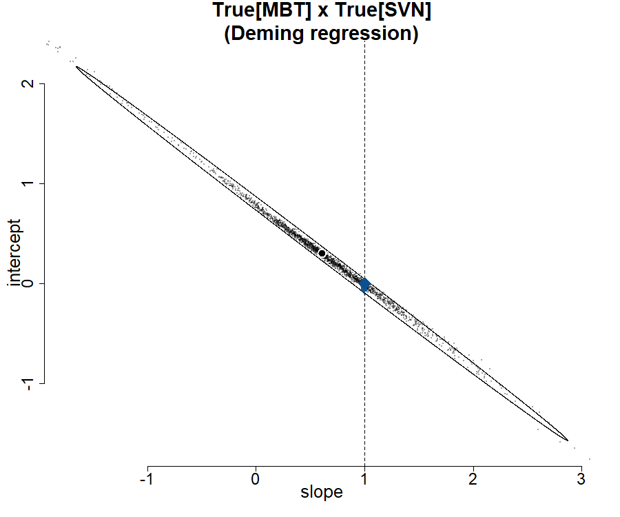
```

