<!-- version -->
<div align=right>
<font style="color:#26a169; font-size:80%">Processed: 2024.08.30 13:46</font>
</div>

```{r setup, include=FALSE}
knitr::opts_chunk$set(echo = TRUE, 
fig.width=7, fig.height=6,
fig.align = "center",
comment = NA)
```

```{css, echo=FALSE}
.bgobs {
  background-color: #f5e9ab;
 }
.bgcodigo {
  background-color: #94a6aa;
 }
.bgsaida {
  background-color: #ecf7db;
 }
```


\clearpage
# Descriptive statistics

<pre>

  ----------
  - raw data
  ----------
     SVM_mBT_1   SVM_mBT_2   SVM_mBT_3   SVM_mBT_4   SVM_mBT_5   SVM_VSN_1   SVM_VSN_2   SVM_VSN_3   SVM_VSN_4   SVM_VSN_5
 1         0.8         0.8         0.8         0.8         0.7         0.9         0.9         0.9         0.9         0.9
 2         0.8         0.6         0.7         0.7         0.7         0.7         0.7         0.8         0.8         0.7
 3         0.9         0.8         0.9         0.9         0.9         0.7         0.7         0.7         0.7         0.7
 4         0.9         0.9         0.8         0.8         0.8         0.8         0.9         0.9         0.9         0.9
 5         0.9         0.8         0.9         0.8         0.9         0.9         0.9         0.9         0.8         0.8
 6         0.9         0.9         0.9         0.9         1.0         0.8         0.7         0.8         0.7         0.7
 7         0.8         0.7         0.8         0.8         0.8         0.9         0.9         0.9         0.9         0.9
 8         0.7         0.5         0.6         0.4         0.7         0.5         0.5         0.7         0.4         0.6
 9         0.8         0.8         0.8         0.8         0.7         0.8         0.7         0.8         0.8         0.7
10         0.7         0.7         0.6         0.6         0.6         0.7         0.6         0.7         0.7         0.6
11         0.7         0.7         0.7         0.8         0.8         0.7         0.7         0.8         0.7         0.7
12         0.9         1.0         0.8         0.9         0.9         0.9         0.8         0.8         0.7         0.8
13         1.0         0.9         0.9         0.9         0.8         0.7         0.8         0.8         0.7         0.8
14         0.9         0.9         0.9         0.9         1.0         0.9         0.9         1.0         0.9         0.8
15         0.8         0.8         0.8         0.9         0.9         0.6         0.6         0.7         0.7         0.7
16         0.8         0.9         0.7         0.8         0.7         0.9         0.9         0.9         0.9         0.9

   ---------
   - summary
   ---------
             SVM_mBT_1      SVM_mBT_2      SVM_mBT_3      SVM_mBT_4      SVM_mBT_5      SVM_VSN_1      SVM_VSN_2      SVM_VSN_3      SVM_VSN_4      SVM_VSN_5
   Min.     Min.0.6552     Min.0.5000     Min.0.6207     Min.0.4167     Min.0.6034     Min.0.5000     Min.0.5000     Min.0.6600     Min.0.4375     Min.0.6000
1st Qu.   1stQu.0.7500   1stQu.0.7329   1stQu.0.7210   1stQu.0.7500   1stQu.0.7143   1stQu.0.7160   1stQu.0.6922   1stQu.0.7476   1stQu.0.7052   1stQu.0.7018
 Median   Median0.8193   Median0.8462   Median0.8273   Median0.8001   Median0.7944   Median0.7633   Median0.7605   Median0.7834   Median0.7445   Median0.7412
3rd Qu.   3rdQu.0.8917   3rdQu.0.8762   3rdQu.0.8812   3rdQu.0.8812   3rdQu.0.8777   3rdQu.0.8650   3rdQu.0.8875   3rdQu.0.8670   3rdQu.0.8702   3rdQu.0.8318
   Max.     Max.0.9608     Max.0.9649     Max.0.9412     Max.0.9412     Max.0.9800     Max.0.9333     Max.0.9474     Max.0.9649     Max.0.9153     Max.0.9245
   Mean     Mean0.8149     Mean0.7952     Mean0.7983     Mean0.7835     Mean0.7987     Mean0.7722     Mean0.7676     Mean0.8000     Mean0.7578     Mean0.7651
   s.d.             NA          0.117          0.131          0.089          0.118          0.101          0.091          0.127          0.102          0.135
      n             16             16             16             16             16             16             16             16             16             16
     NA              0              0              0              0              0              0              0              0              0              0

  ---------------------
  - data under analysis
  ---------------------
     SVMMBT   SVMVSN
 1      0.8      0.9
 2      0.7      0.7
 3      0.9      0.7
 4      0.8      0.9
 5      0.9      0.8
 6      0.9      0.7
 7      0.8      0.9
 8      0.6      0.6
 9      0.8      0.8
10      0.6      0.7
11      0.7      0.7
12      0.9      0.8
13      0.9      0.8
14      0.9      0.9
15      0.8      0.7
16      0.8      0.9

   ---------
   - summary
   ---------
                SVMMBT         SVMVSN
   Min.     Min.0.5833     Min.0.5500
1st Qu.   1stQu.0.7524   1stQu.0.7219
 Median   Median0.8130   Median0.7530
3rd Qu.   3rdQu.0.8873   3rdQu.0.8700
   Max.     Max.0.9176     Max.0.9000
   Mean     Mean0.7981     Mean0.7725
   s.d.          0.103          0.103
      n             16             16
     NA              0              0

</pre>

<pre>

Lambda = 0.838738 [0.511586,1.375098]

</pre>

## Traditional correlation

<pre>

	Pearson's product-moment correlation

data:  as.numeric(unlist(data[, 1])) and as.numeric(unlist(data[, 2]))
t = 2.0673, df = 14, p-value = 0.05771
alternative hypothesis: true correlation is not equal to 0
95 percent confidence interval:
 -0.01590956  0.78994354
sample estimates:
      cor 
0.4836097 

</pre>

## Raw data
```{r, echo=FALSE, out.width = "90%"}
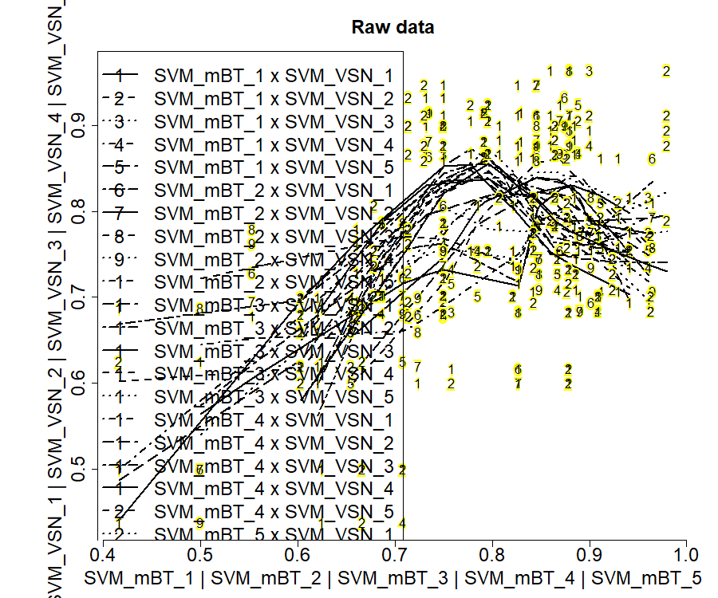
```


## Distribution of original data

### - density plots
```{r, echo=FALSE, out.width = "90%"}
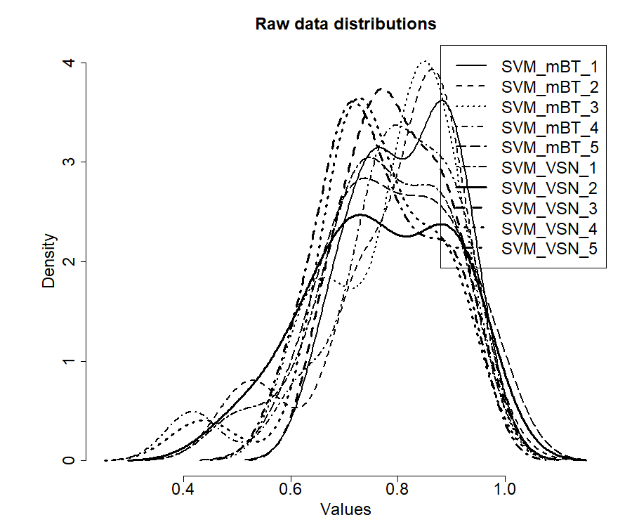
```

```{r, echo=FALSE, out.width = "90%"}
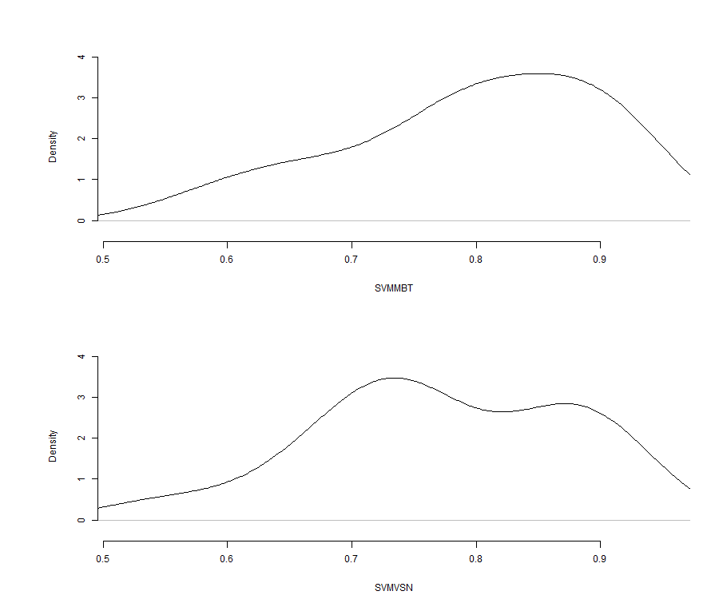
```


### - boxplots
```{r, echo=FALSE, out.width = "90%"}
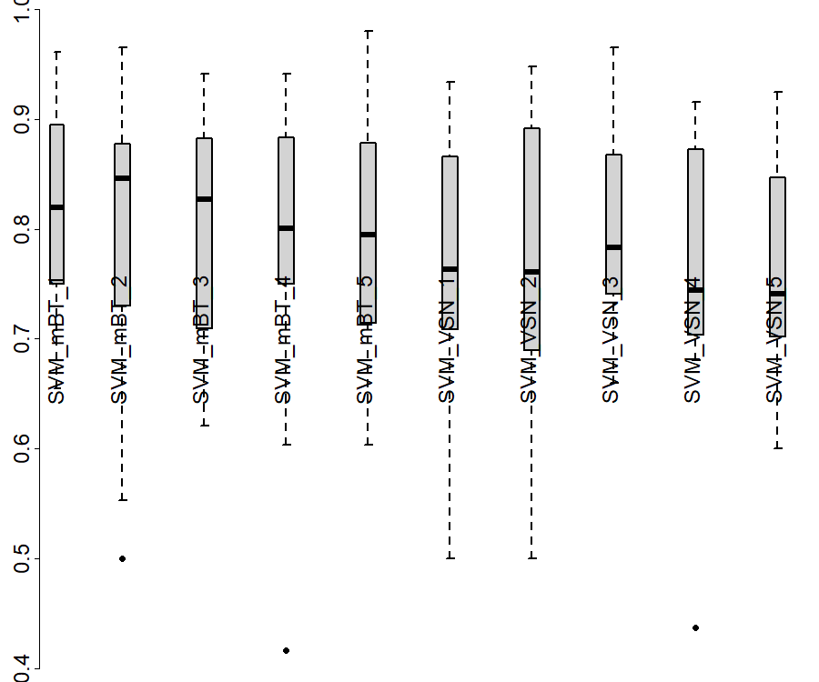
```

```{r, echo=FALSE, out.width = "90%"}
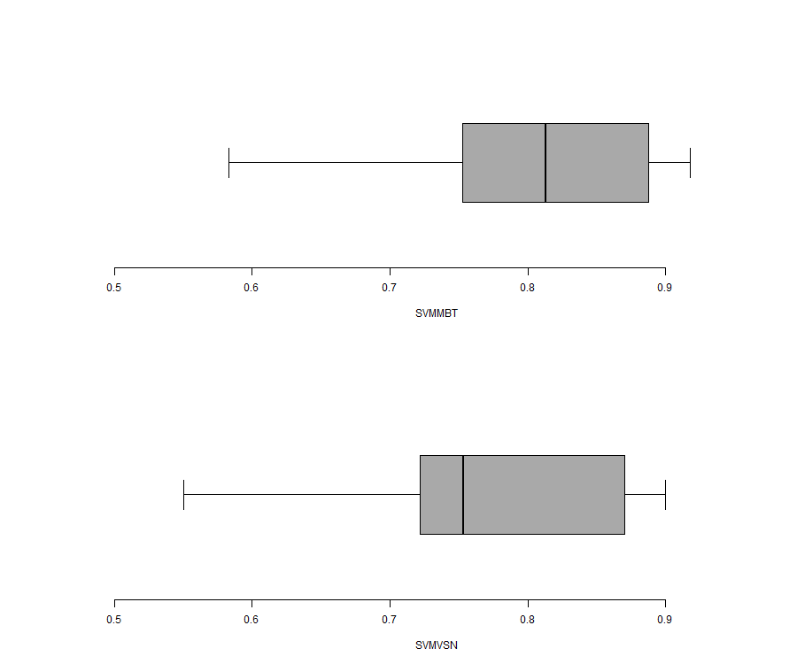
```


### - bagplot
```{r, echo=FALSE, out.width = "90%"}
knitr::include_graphics("./graph/SVMMBT_x_SVMVSN_bagplot.png")
```


## Robust ordinary least square linear regression
```{r, echo=FALSE, out.width = "90%"}
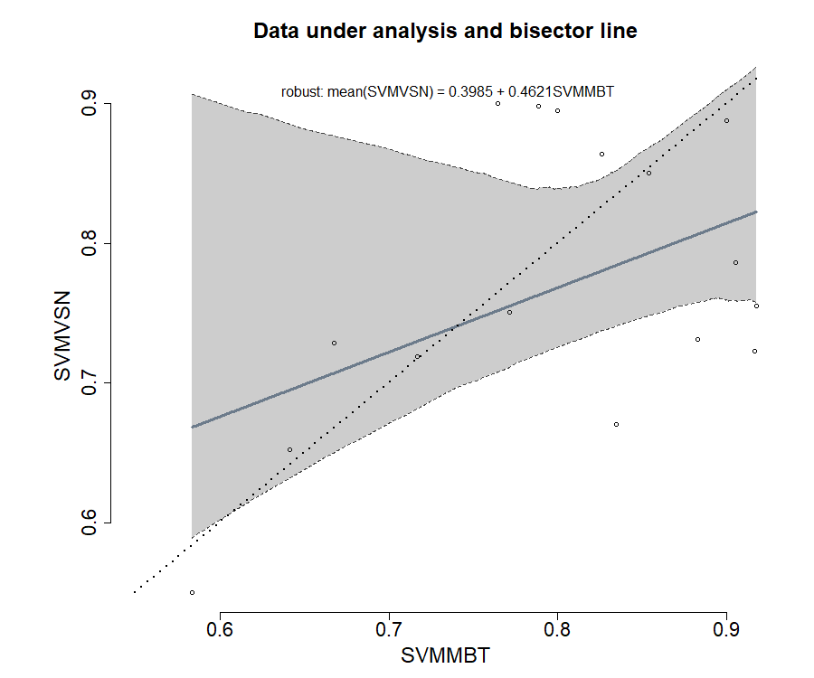
```


## Classical Bland and Altman plot method

### raw data
```{r, echo=FALSE, out.width = "90%"}
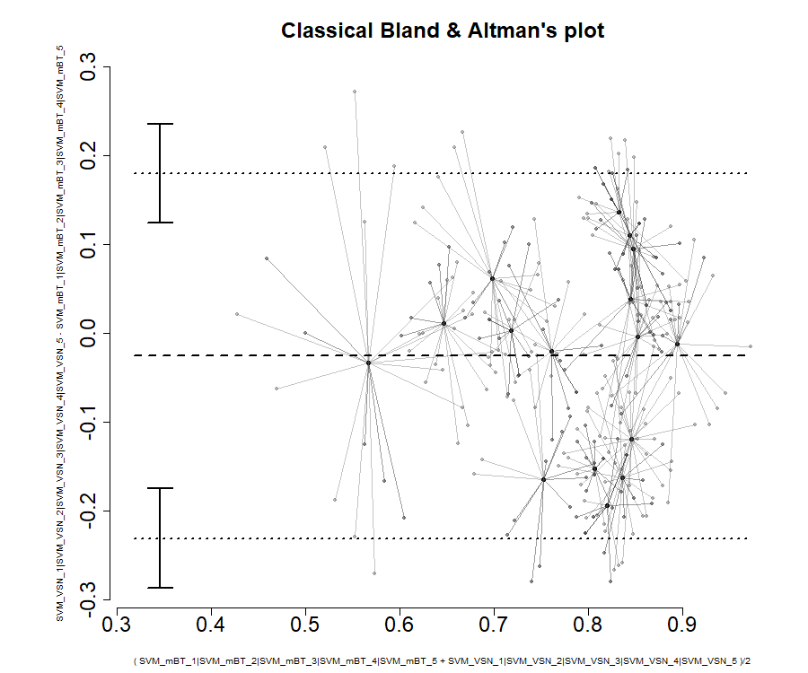
```


### data under analysis
```{r, echo=FALSE, out.width = "90%"}
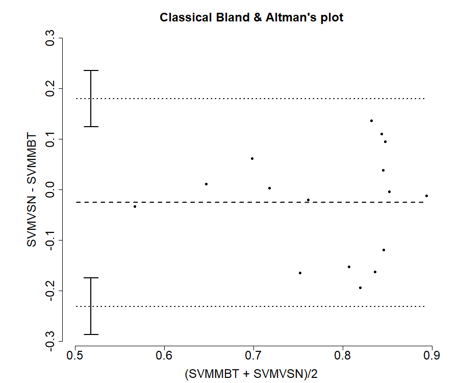
```


<pre>
             estimate
mean.diff -0.02558754
lowerLoA  -0.23064388
upperLoA   0.17946880
ciLoA      0.05574837
alpha      0.05000000
</pre>

\clearpage
# Test of structural accuracy

<pre>
Hedberg, EC, Ayers, S (2015) The power of a paired t-test
with a covariate. Social Science Research 50: 277-91

-------
- model
-------
	IV = SVMMBT - mean(SVMMBT)
	DV = SVMVSN - SVMMBT

----------------------------
- functional robust approach
----------------------------

Decision by 95% confidence interval:
	avg{SVMVSN - SVMMBT} = -0.0218 + -0.531 {SVMMBT - mean(SVMMBT)}

	H0: accuracy point(0,0) inside 95% CI [-0.0727, 0.0412] is not rejected
	n: 16 data pairs
	bootstrapping: 2000 resamplings
	Bias 95%CI: between -0.0727 and 0.0412.

</pre>
```{r, echo=FALSE, out.width = "90%"}
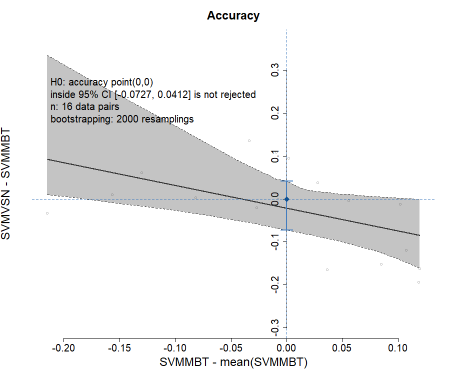
```


\clearpage
# Test of structural precision

<pre>

-------------
- lambda test
-------------
 
 Francq B, Berger M (2019). 
BivRegBLS: Tolerance Interval and EIV Regression -
Method Comparison Studies_. R package version 1.1.1,
https://CRAN.R-project.org/package=BivRegBLS

Chapter 303, NCSS 11 (2016): Deming regression
https://www.ncss.com/wp-content/themes/ncss/pdf/
	Procedures/NCSS/Deming_Regression.pdf

Assuming repeated measures per method:
	- reference method (5): SVMMBT (SVM_mBT_1, SVM_mBT_2, SVM_mBT_3, SVM_mBT_4, SVM_mBT_5)
	- putative method (5): SVMVSN (SVM_VSN_1, SVM_VSN_2, SVM_VSN_3, SVM_VSN_4, SVM_VSN_5)
 
 lambda = V[delta]/V[epsilon] = 1 is not rejected
</pre>

<pre>

Shukla, GK (1973) Some exact tests on hypothesis
about Grubbs estimators. Biometrics 29: 373-377

-------
- model
-------
	IV = (SVMMBT + SVMVSN) / 2
	DV = SVMVSN - SVMMBT

----------------------------
- functional robust approach
----------------------------

Decision by 95% confidence band:
	avg{SVMVSN - SVMMBT} = -0.0375 + 0.0173 {(SVMMBT + SVMVSN)/2}

	H0: precision line horizontal (x,0)
	with translation from -0.0727 to 0.0412 inside 95% CB is not rejected
	n: 16 data pairs
	bootstrapping: 2000 resamplings
</pre>
```{r, echo=FALSE, out.width = "90%"}
knitr::include_graphics("./graph/SVMMBT_x_SVMVSN_precision.png")
```


\clearpage
# Test of structural reliability

## structural bisector line

<pre>
Creasy, MA (1956) Confidence Limits for the Gradient
in the Linear Functional Relationship. Journal of the 
Royal Statistical Society 18(1):65-69

Glaister, P (2001) Least squares revisited.
The Mathematical Gazette 85(502): 104-107.

-------
- model
-------

	X = True[SVMMBT]
	Y = True[SVMVSN]

Deming regression for reliability
	Y = intercept + slope . X

----------------------------
- functional robust approach
----------------------------

Decision by 95% confidence band:
	avg{True[SVMVSN]} = -0.08 + 1.0704 {True[SVMMBT]}

	H0: reliability line IV=DV
	with translation from -0.0727 to 0.0412 inside 95% CB is not rejected
lambda = 0.838738
	n: 16 data pairs
	bootstrapping: 2000 resamplings
</pre>
```{r, echo=FALSE, out.width = "90%"}
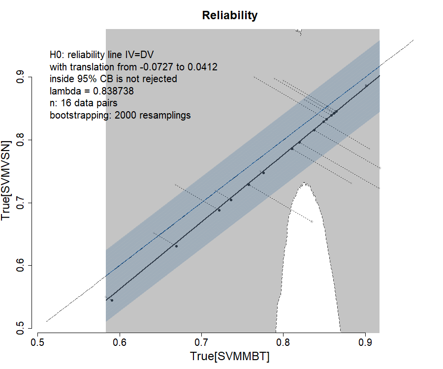
```


## structural confidence elliptical region

<pre>


Decision by 95% confidence ellipse:

	H0: intercept = [-0.0727,0.0412], slope = 1 inside 95% ellipse is not rejected
	n: 16 data pairs
	bootstrapping: 2000 resamplings
</pre>
```{r, echo=FALSE, out.width = "90%"}
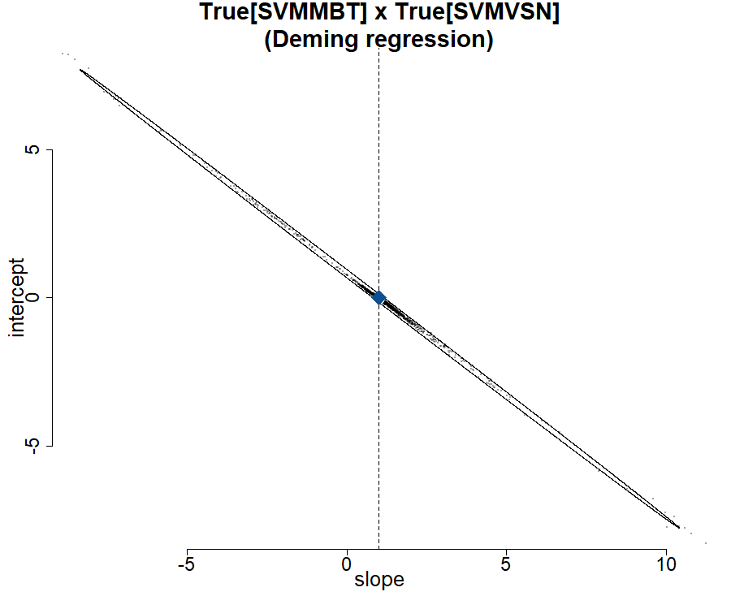
```

